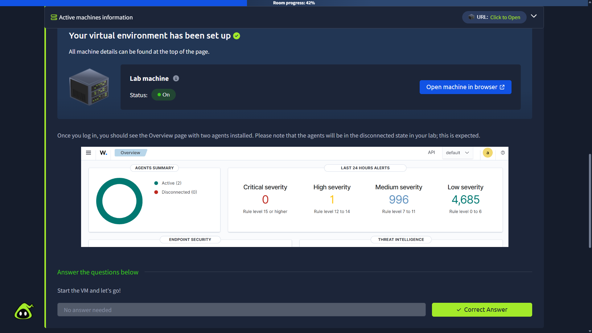
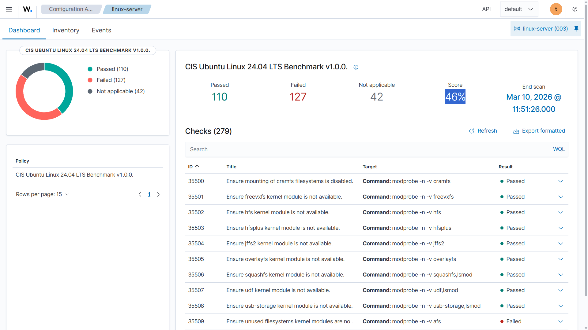
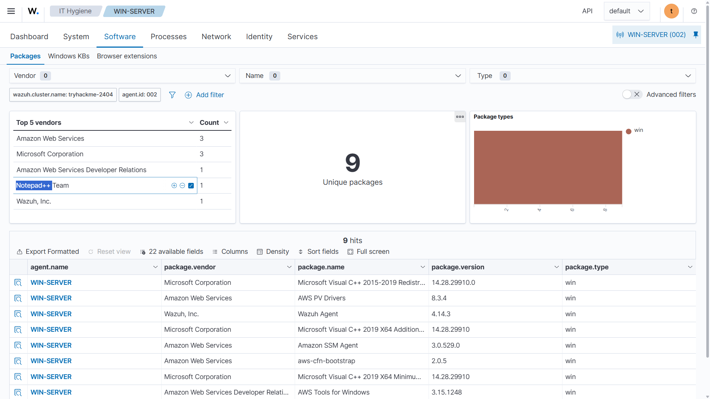
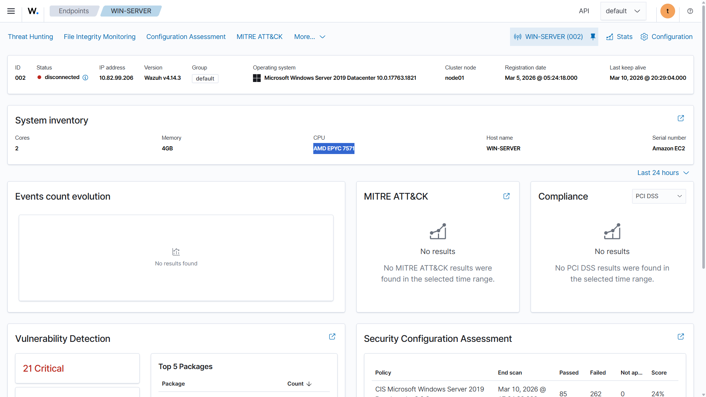
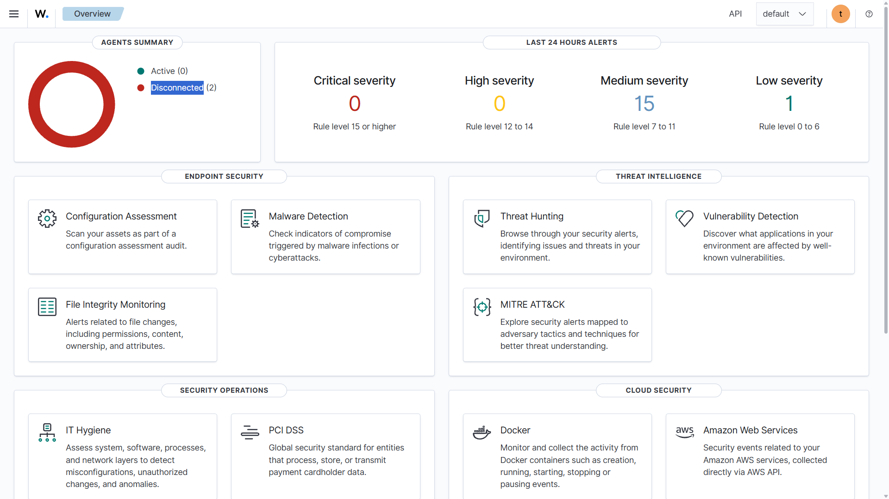
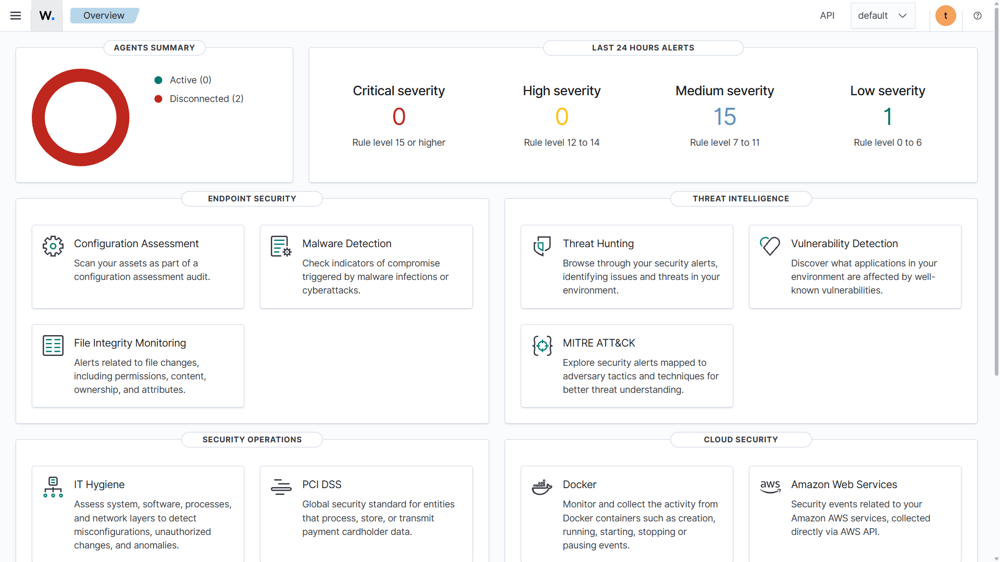
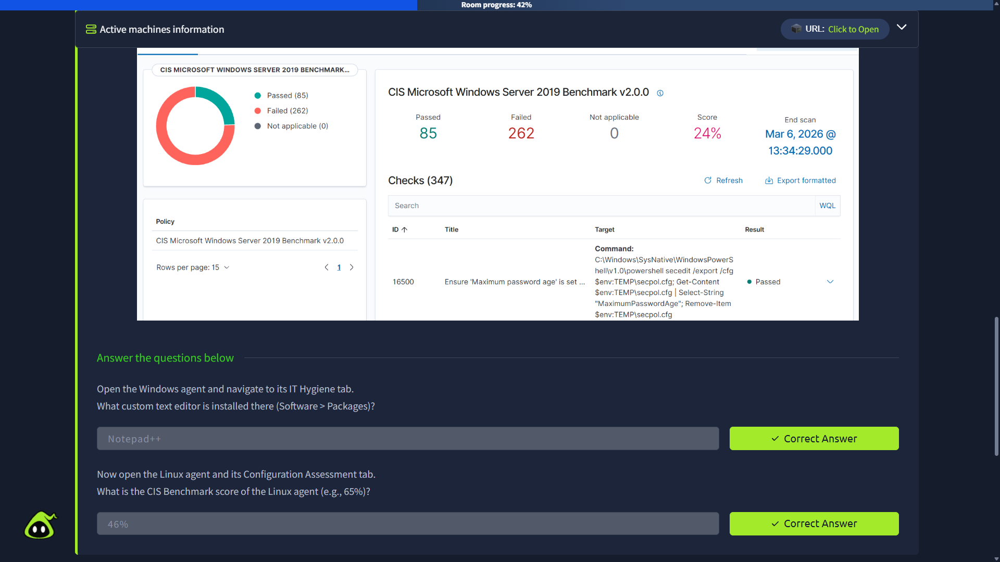
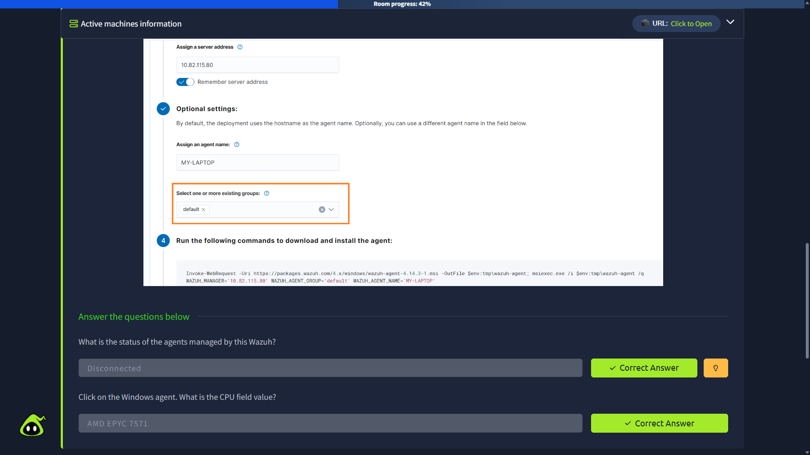
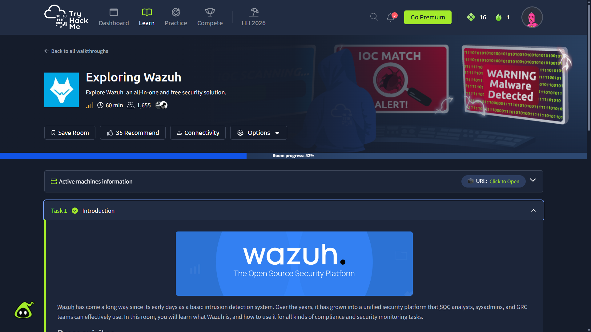

# TryHackMe — Exploring Wazuh

Hands-on documentation for the TryHackMe **Exploring Wazuh** room.

**Room:** https://tryhackme.com/room/exploringwazuh

> This repository documents the work evidenced by the supplied screenshots. The screenshots are retained in full under `evidence/` and are referenced individually below.

---

## 1. Lab Overview

The **Exploring Wazuh** room introduces Wazuh as an open-source security platform and provides practical exposure to endpoint monitoring, agent management, vulnerability visibility, configuration assessment, IT hygiene, security alerts, compliance, and the Wazuh dashboard.

Wazuh follows a manager/agent architecture: monitored endpoints run Wazuh agents, while the central Wazuh components collect and process security data. The official Wazuh documentation describes the platform as providing unified XDR and SIEM capabilities across endpoints and cloud workloads.

## 2. Lab Progress

At the time of the supplied capture, the TryHackMe room displayed:

**Room progress: 42%**



---

# 3. Evidence and Observations

## Evidence 01 — Linux CIS Security Configuration Assessment

**File:** `evidence/01-wazuh-linux-sca-46-percent.png`



### Observed

The Linux endpoint was opened in Wazuh's **Configuration Assessment** area.

Policy:

**CIS Ubuntu Linux 24.04 LTS Benchmark v1.0.0**

Results shown:

| Metric | Result |
|---|---:|
| Passed | 110 |
| Failed | 127 |
| Not applicable | 42 |
| Total checks | 279 |
| Score | **46%** |

The screenshot also shows individual benchmark checks, including checks for kernel modules and unused filesystems.

### Security significance

Security Configuration Assessment compares endpoint configuration against security policies and benchmarks. A low benchmark score indicates that a large number of configuration checks require review or remediation.

---

## Evidence 02 — Windows IT Hygiene / Software Inventory

**File:** `evidence/02-wazuh-windows-it-hygiene-packages.png`



### Observed

The Windows endpoint was opened under:

**IT Hygiene → Software → Packages**

The dashboard showed:

- **9 unique packages**
- Package type: `win`
- Microsoft Visual C++ Redistributables
- AWS PV Drivers
- Amazon SSM Agent
- `aws-cfn-bootstrap`
- AWS Tools for Windows
- Wazuh Agent
- Notepad++ Team

### Lab answer

**Custom text editor installed:** `Notepad++`

### Security significance

Software inventory gives defenders visibility into what is installed on an endpoint. This information can then support vulnerability management and software hygiene.

---

## Evidence 03 — Windows Agent Details and System Inventory

**File:** `evidence/03-wazuh-windows-agent-overview.png`



### Observed

| Field | Value |
|---|---|
| Agent ID | `002` |
| Status | **Disconnected** |
| IP address | `10.82.99.206` |
| Wazuh version | `v4.14.3` |
| Operating system | Microsoft Windows Server 2019 Datacenter 10.0.17763.1821 |
| Host name | `WIN-SERVER` |
| Cluster node | `node01` |
| Cores | `2` |
| Memory | `4 GB` |
| CPU | **AMD EPYC 7571** |

### Lab answers

**Agent status:** `Disconnected`

**CPU:** `AMD EPYC 7571`

---

## Evidence 04 — Wazuh Overview / Alert Summary

**File:** `evidence/04-wazuh-overview-dashboard-disconnected-agents.png`



### Observed dashboard state

The supplied screenshot showed:

| Category | Count |
|---|---:|
| Active agents | 0 |
| Disconnected agents | 2 |
| Critical severity | 0 |
| High severity | 0 |
| Medium severity | 15 |
| Low severity | 1 |

The dashboard also exposed modules such as:

- Configuration Assessment
- Malware Detection
- Threat Hunting
- Vulnerability Detection
- File Integrity Monitoring
- MITRE ATT&CK
- IT Hygiene
- PCI DSS
- Docker
- Amazon Web Services

> Dashboard counts are state-dependent. They describe the captured lab state and should not be interpreted as permanent values.

---

## Evidence 05 — Windows Server 2019 CIS Benchmark

**File:** `evidence/05-tryhackme-windows-benchmark.png`



### Observed

Policy:

**CIS Microsoft Windows Server 2019 Benchmark v2.0.0**

Results:

| Metric | Result |
|---|---:|
| Passed | 85 |
| Failed | 262 |
| Not applicable | 0 |
| Total checks | 347 |
| Score | **24%** |

### Security significance

This demonstrates configuration auditing against a standardized Windows Server security benchmark. The high number of failed checks indicates that the captured system has substantial hardening opportunities.

---

## Evidence 06 — Completed TryHackMe Questions

**File:** `evidence/06-tryhackme-windows-agent-questions.png`



### Answers evidenced in the screenshot

**Question:** What is the status of the agents managed by this Wazuh?

**Answer:** `Disconnected`

**Question:** What is the CPU field value?

**Answer:** `AMD EPYC 7571`

Both answers are visibly marked **Correct Answer** in the supplied screenshot.

---

## Evidence 07 — TryHackMe Virtual Environment Setup

**File:** `evidence/07-tryhackme-lab-machine-setup.png`



### Observed

The TryHackMe environment reported:

**Your virtual environment has been set up**

The lab machine was shown as **On**, with an option to open the machine in the browser.

The screenshot also explains that the supplied environment is intentionally expected to show agents in a disconnected state.

---

## Evidence 08 — TryHackMe Room Progress

**File:** `evidence/08-tryhackme-room-progress-42-percent.png`


### Observed

- Room: **Exploring Wazuh**
- Progress: **42%**
- Task 1: Introduction shown as completed
- Active machine information available
- Wazuh environment supplied by TryHackMe

This screenshot establishes the lab context and progress at the time the evidence was collected.

---

## Evidence 09 — Wazuh Overview Dashboard

**File:** `evidence/09-wazuh-overview-dashboard.png`



### Observed

This screenshot provides a second overview of the Wazuh security platform and its major capabilities.

Visible areas include:

### Endpoint Security

- Configuration Assessment
- Malware Detection
- File Integrity Monitoring

### Threat Intelligence

- Threat Hunting
- Vulnerability Detection
- MITRE ATT&CK

### Security Operations

- IT Hygiene
- PCI DSS

### Cloud Security

- Docker
- Amazon Web Services

This evidence is useful because it demonstrates the breadth of Wazuh beyond simple endpoint alerting.

---

# 4. Consolidated Lab Answers

| Question | Answer |
|---|---|
| What custom text editor is installed on the Windows agent? | **Notepad++** |
| What is the CIS Benchmark score of the Linux agent? | **46%** |
| What is the status of the agents managed by Wazuh in the captured state? | **Disconnected** |
| What is the Windows agent CPU field value? | **AMD EPYC 7571** |

---

# 5. Key Technical Concepts Learned

## 5.1 Wazuh Agents

A Wazuh agent runs on a monitored endpoint and collects security-relevant information such as system events, inventory, configuration, and other telemetry.

The agent sends collected information to the Wazuh management infrastructure for processing and visualization.

## 5.2 Security Configuration Assessment

SCA evaluates endpoint configuration against defined security policies and benchmarks.

In this lab:

- Ubuntu benchmark score: **46%**
- Windows Server benchmark score: **24%**

The results demonstrate how configuration assessment can identify hardening gaps.

## 5.3 IT Hygiene

IT Hygiene provides visibility into endpoint assets and installed software.

In this lab, software inventory was used to identify **Notepad++** on the Windows endpoint.

## 5.4 Vulnerability Detection

Wazuh can use endpoint software inventory to identify applications and versions that may be affected by known vulnerabilities.

This creates a useful defensive workflow:

`Asset Inventory → Software Identification → Vulnerability Identification → Remediation`

## 5.5 Security Monitoring

The Wazuh dashboard combines multiple security capabilities into a single interface, including:

`Alerts + SCA + Vulnerabilities + File Integrity + Threat Hunting + Compliance + MITRE ATT&CK`

This is relevant to SOC and blue-team workflows because analysts need centralized visibility across endpoints.

---

# 6. Skills Demonstrated

This lab provided practical exposure to:

- Wazuh dashboard navigation
- Wazuh agent management
- Endpoint system inventory
- Software inventory
- CIS benchmark interpretation
- Security Configuration Assessment
- Vulnerability Detection concepts
- Security alert severity
- IT Hygiene
- Compliance/security modules
- TryHackMe virtual lab environments
- Evidence collection and technical documentation

---

# 7. Evidence Directory

All supplied screenshots are preserved in the `evidence/` directory.

```text
evidence/
├── 01-wazuh-linux-sca-46-percent.png
├── 02-wazuh-windows-it-hygiene-packages.png
├── 03-wazuh-windows-agent-overview.png
├── 04-wazuh-overview-dashboard-disconnected-agents.png
├── 05-tryhackme-windows-benchmark.png
├── 06-tryhackme-windows-agent-questions.png
├── 07-tryhackme-lab-machine-setup.png
├── 08-tryhackme-room-progress-42-percent.png
├── 09-wazuh-overview-dashboard.png
└── README.md
```

Every screenshot is linked directly from this README so the repository can be reviewed without having to guess which screenshot supports which finding.

---

# 8. References

- TryHackMe — Exploring Wazuh: https://tryhackme.com/room/exploringwazuh
- Wazuh Documentation: https://documentation.wazuh.com/current/
- Wazuh User Manual: https://documentation.wazuh.com/current/user-manual/
- Wazuh official documentation repository: https://github.com/wazuh/wazuh-documentation

---

# 9. Disclaimer

This documentation is for cybersecurity learning and portfolio purposes.

The screenshots and observations were collected from an authorized TryHackMe training environment. No unauthorized systems were targeted.

